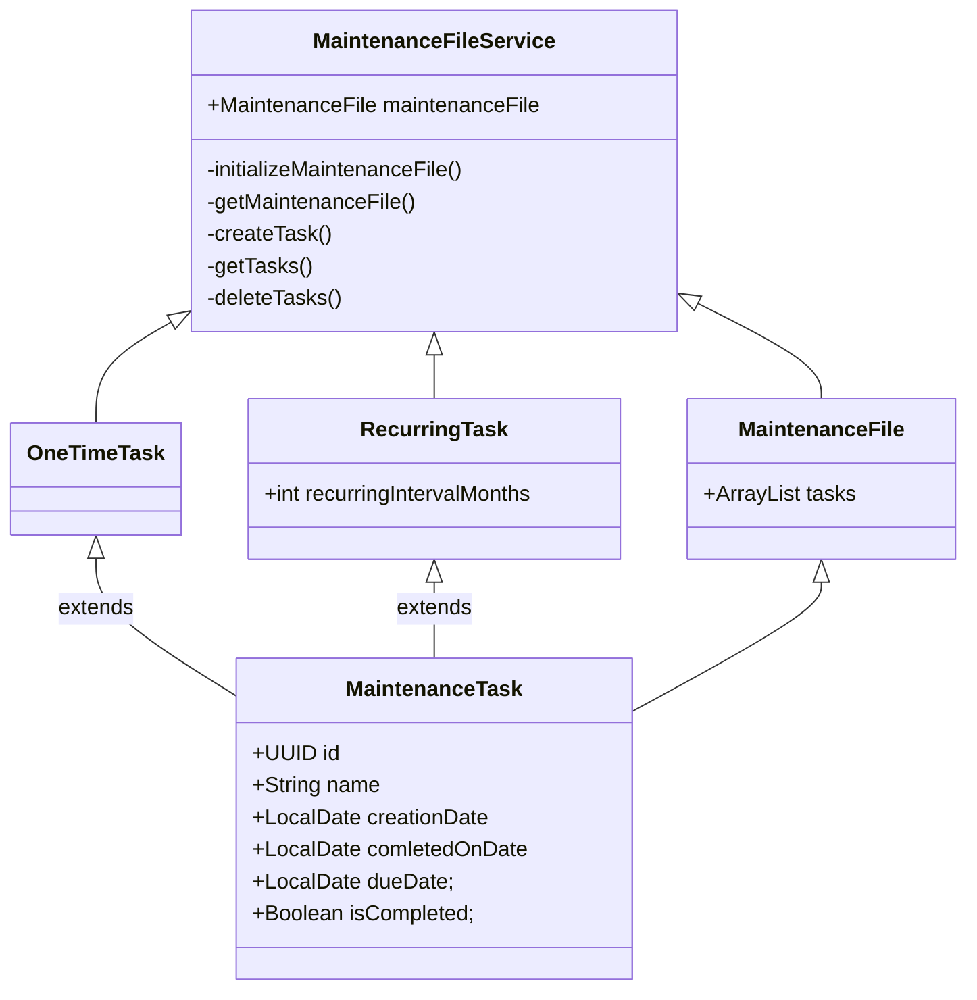
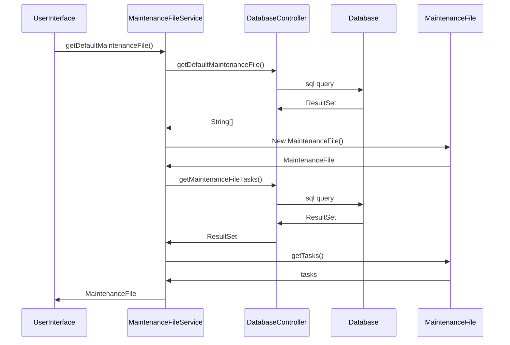

## Rakenne

MaintenanceFileService luokka toimii ohjelman keskuksena.
MaintenanceFileService luokka luo huolto-ohjelman MaintenanceFile ja MaintenanceTask luokkien avulla.
Käyttöliittymä kommunikoi pelkästään MaintenanceFileServicen kanssa ja saa sen kautta tietoa huolto-ohjemasta (MaintenanceFile).
DatabaseController sisältää kaiken tietokantaan liittyvän logiikan. MaintenaceFileService on ainoa luokka joka on yhteydessä DatabaseControlleriin.

 ```mermaid
 classDiagram
 	MaintenanceFileService <- MaintenanceFile
	MaintenanceFileService <- OneTimeTask
	MaintenanceFileService <- RecurringTask
	OneTimeTask <- MaintenanceTask
	RecurringTask <- MaintenanceTask
	MaintenanceFileService<->ui
	DatabaseController<->MaintenanceFileService
 
 ```
## Luokkakaavio



## Käynnistyksen sekvenssikaavio



