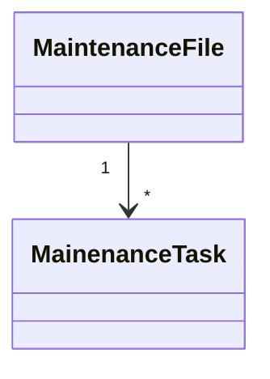
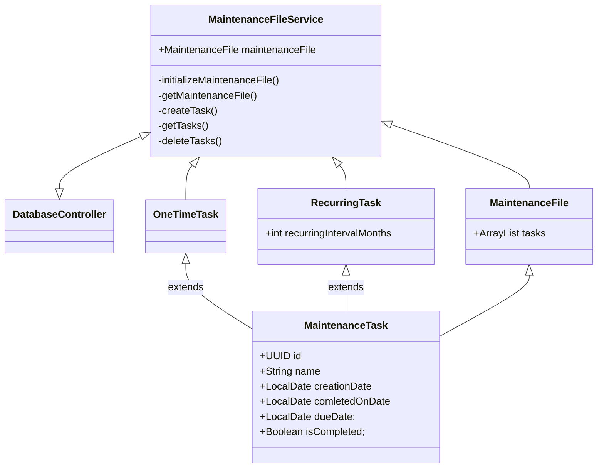
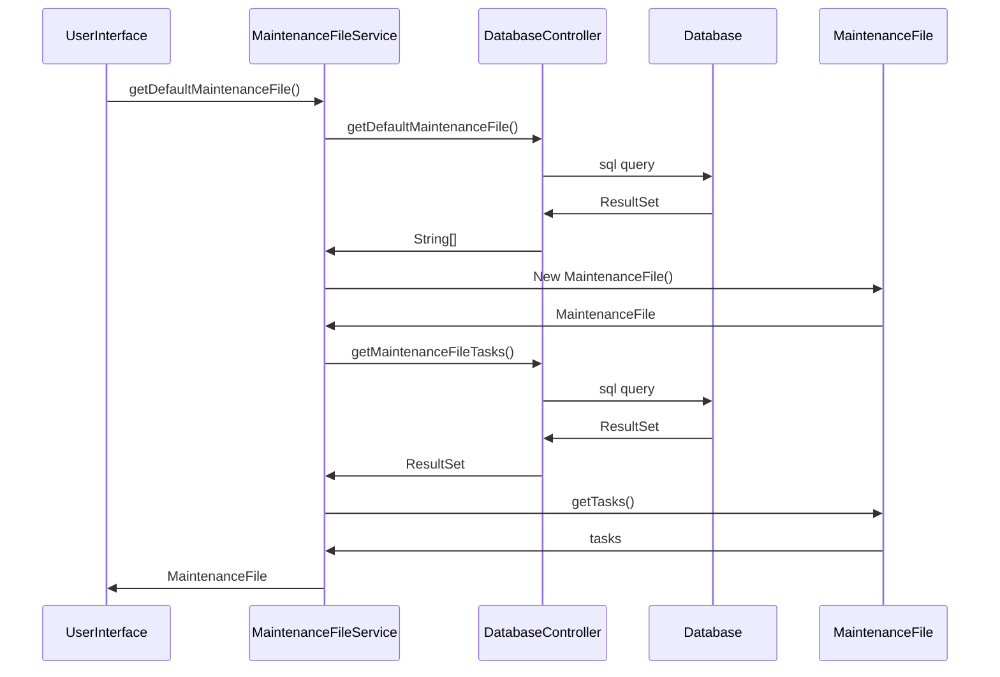

## Rakenne

MaintenanceFileService luokka toimii ohjelman keskuksena.
MaintenanceFileService luokka luo huolto-ohjelman MaintenanceFile ja MaintenanceTask luokkien avulla.
Käyttöliittymä kommunikoi pelkästään MaintenanceFileServicen kanssa ja saa sen kautta tietoa huolto-ohjemasta (MaintenanceFile).
DatabaseController sisältää kaiken tietokantaan liittyvän logiikan. MaintenaceFileService on ainoa luokka joka on yhteydessä DatabaseControlleriin.

 ```mermaid
 classDiagram
 	MaintenanceFileService -- MaintenanceFile
	MaintenanceFileService -- OneTimeTask
	MaintenanceFileService -- RecurringTask
	OneTimeTask -- MaintenanceTask
	RecurringTask -- MaintenanceTask
	MaintenanceFileService -- ui
	DatabaseController -- MaintenanceFileService
 
 ```
 
## Käyttöliittymä

Käyttöliittymä kostuu neljästä näkymästä
- File, jossa käyttäjä voi luoda ja muokata huolto-ohjelmia (Maintenance File)
- Edit, jossa käyttäjä voi luoda ja muokata huolto-ohjelmaan (Maintenance File) liittyviä huoltotoimenpiteitä (Maintenance Task)
- View, jossa käyttäjä voi katsella ajankohtaisia huoltotoimenpiteitä (Maintenance Task) ja merkitä niitä hoidetuksi
- Report, jossa käyttäjä voi luoda raportin huolto-ohjelman (Maintenance File) tehdyistä huoltotoimenpideistä (Maintenance Task) pdf muodossa

 Eri näkymiä hallinnoi UserInterface.java luokka joka sisältää navigointi menun. Eri näkymät ovat toteutettu staattisina singleton luokkina,
 joiden alkutila luodaan kun käyttäjä ensimmäisen kerran navigoi näkymään menun kautta. Staattisten signleton luokkien ideana on, 
 että ne säilyttävät tilansa kun käyttäjä vaihtaa näkymien välillä.
 
 Käyttöliittymä on eriytetty muusta sovelluslogiikasta ja käyttöliittymä kommunikoi muun ohjelman kanssa MaintenaceFileService luokan avulla.
 
## Sovelluslogiikka ja Luokkakaavio

Sovelluksen tietorakenne koostuu MaintenanceFile ja MaintenanceTask luokista. MaintenanceTask luokkaa laajentaa OneTimeTask ja RecurringTask luokat. 
MaintenanceFile on yksi kokonaisuus johon on liitetty useampi MaintenanceTask luokkia. 


MaintenanceFileService luokka toimii kokonaisuuden keskuksena ja pystyy luomaan, muokkaamaan ja poistamaan MaintenanceFile ja MaintenanceTask luokkia ja liittämään niitä yhteen. 
MaintenanceFileService luokka tallentaa myös luokat tietokantaan pysyväistallennusta varten ja antaa käyttöliittymälle tarvittavan datan. 



## Tietojen pysyväistallennus

### Tietokanta

MaintenanceFile ja MaintenanceTask luokat tallentuvta tietokantaan pysyväistallennusta varten. DatabaseController sisältää kaiken tietokantaan liittyvän logiikan. 
MaintenaceFileService luokka kutsuu DatabaseController luokkaa kun se haluaa hakea, tallentaa tai päivittää tietokantaa.
DatabaseController luo käynnistyken yhteydessä tietokannan ellei sellaista jo ole. Tietokantatiedosto sijaitsee ohjelman juuressa.
Testausta varten käyttää DatabaseController muistissa sijaitsevaa sqllite tietokantaa.


### Pdf raportin tallennus

Pdf raportin luontiin on käytetty apunaan pdfbox kirjastoa. Kun käyttäjä luo pdf-raportin voi hän valita mihin tiedoston tallentaa, jonka jälkeen pdfbox luo
pdf-tiedoston ja tallentaa sen haluttuun kansioon.

## Käynnistyksen sekvenssikaavio



## Ohjelmaan jääneet heikkoudet

Erilliset DAO-luokat jäi toteutumatta ja olioiden rakenne jäi tavallisten luokkien varaan. 
MaintenanceFileService luokka paisui turhan isoksi ja sitä voisi pilkkoa esimerkiksi siten, että MaintenanceFile, MaintenanceTask ja DatabaseController luokille olisi
omat service luokat.

Käyttöliittymän ulkoasu jäi varsin karuksi. Seuraavissa versioissa voisi käyttöliittymään lisätä tyylejä joka tekisi ohjelmasta käyttäjäystävällisempää. 
