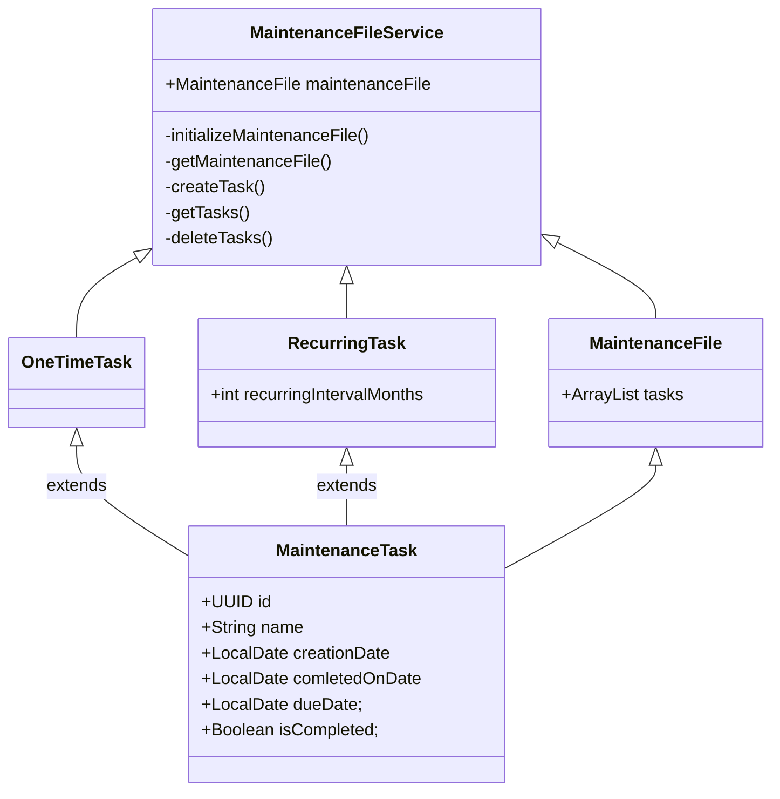

## Luokkakaavio

```mermaid
classDiagram
	MaintenanceFileService <|-- MaintenanceFile
	MaintenanceFileService <|-- OneTimeTask
	MaintenanceFileService <|-- RecurringTask
	OneTimeTask <|-- MaintenanceTask : extends
	RecurringTask <|-- MaintenanceTask : extends
	MaintenanceFile <|-- MaintenanceTask
	class MaintenanceFile{
		+ArrayList<MaintenanceTask> tasks
		}
	class MaintenanceTask{
		+UUID id
		+String name
		+LocalDate creationDate
		+LocalDate comletedOnDate
		+LocalDate dueDate;
		+Boolean isCompleted;
		}
	class RecurringTask{
		+int recurringIntervalMonths
		}
	class MaintenanceFileService{
		+MaintenanceFile maintenanceFile
		-initializeMaintenanceFile()
		-getMaintenanceFile()
		-createTask()
		-getTasks()
		-deleteTasks()
		}

```
