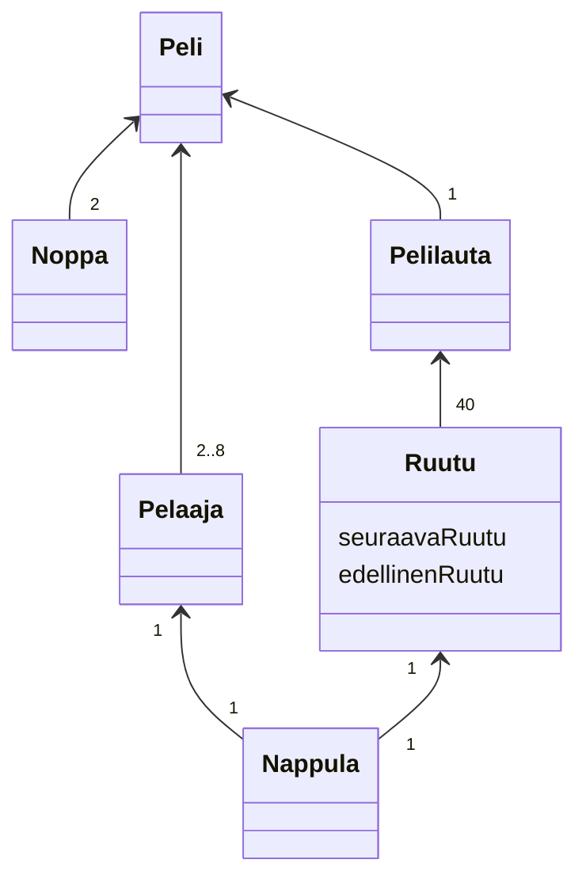

## Sovelluslogiikka

```mermaid
 classDiagram
    Peli <-- "2..8" Pelaaja
	Peli <-- "2" Noppa
	Peli <-- "1" Pelilauta
	Pelilauta <-- "40" Ruutu
	Pelaaja "1" <-- "1" Nappula
	Ruutu "1" <-- "1" Nappula
	
	class Ruutu{
		seuraavaRuutu
		edellinenRuutu
		}
 
```