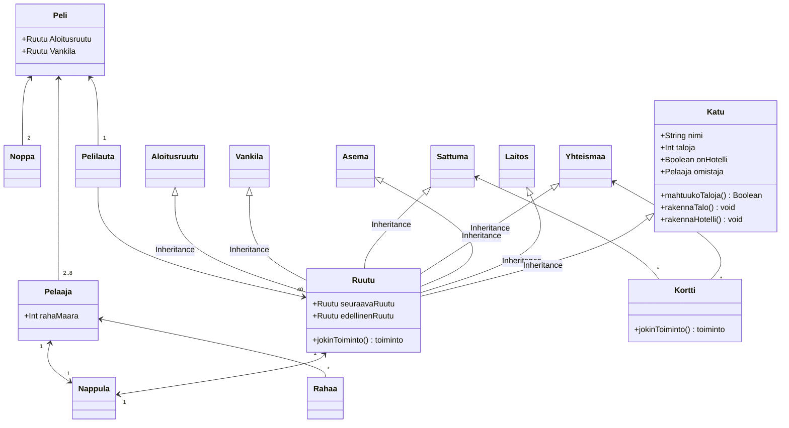
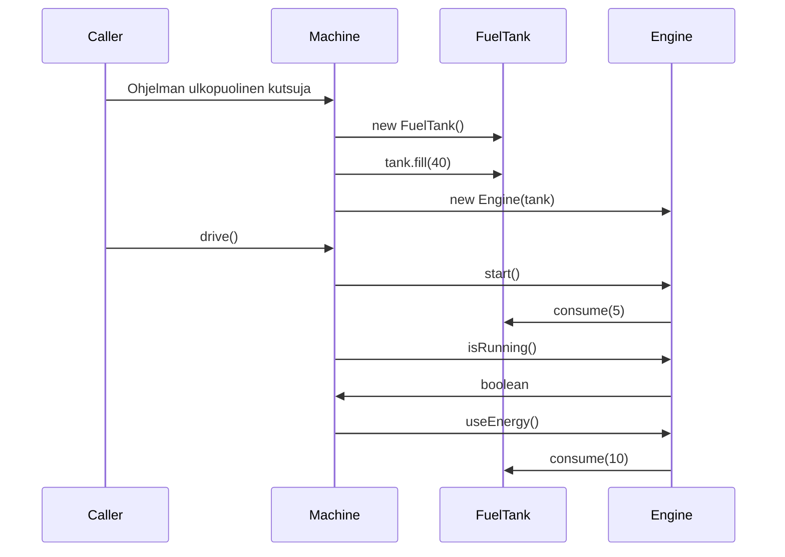

## Luokkakaavio

```mermaid
 classDiagram
    Peli <-- "2..8" Pelaaja
	Peli <-- "2" Noppa
	Peli <-- "1" Pelilauta
	Pelilauta --> "40" Ruutu
	Pelaaja "1" <--> "1" Nappula
	Ruutu "1" <--> "1" Nappula
	Aloitusruutu <|-- Ruutu : Inheritance
	Vankila <|-- Ruutu : Inheritance
	Sattuma <|-- Ruutu : Inheritance
	Yhteismaa <|-- Ruutu : Inheritance
	Asema <|-- Ruutu : Inheritance
	Laitos <|-- Ruutu : Inheritance
	Katu <|-- Ruutu : Inheritance
	Sattuma <-- "*" Kortti
	Yhteismaa <-- "*" Kortti
	Pelaaja <-- "*" Rahaa
	
	class Ruutu{
		+Ruutu seuraavaRuutu
		+Ruutu edellinenRuutu
		+jokinToiminto() toiminto
		}
	class Katu {
		+String nimi
		+Int taloja
		+Boolean onHotelli
		+Pelaaja omistaja
		+mahtuukoTaloja() Boolean
		+rakennaTalo() void
		+rakennaHotelli() void
		}
	class Peli{
		+Ruutu Aloitusruutu
		+Ruutu Vankila
		}
	class Kortti{
		+jokinToiminto() toiminto
		}
	class Pelaaja{
		+Int rahaMaara
		}
```

## Sekvenssikaavio Machine

```mermaid
sequenceDiagram
	Caller->>Machine: Ohjelman ulkopuolinen kutsuja
	Machine->>FuelTank: new FuelTank()
	Machine->>FuelTank: tank.fill(40)
	Machine->>Engine: new Engine(tank)
	Caller->>Machine: drive()
	Machine->>Engine: start()
	Engine->>FuelTank: consume(5)
	Machine->> Engine: isRunning()
	Engine->> Machine: boolean
	Machine->>Engine: useEnergy()
	Engine->>FuelTank: consume(10)
```